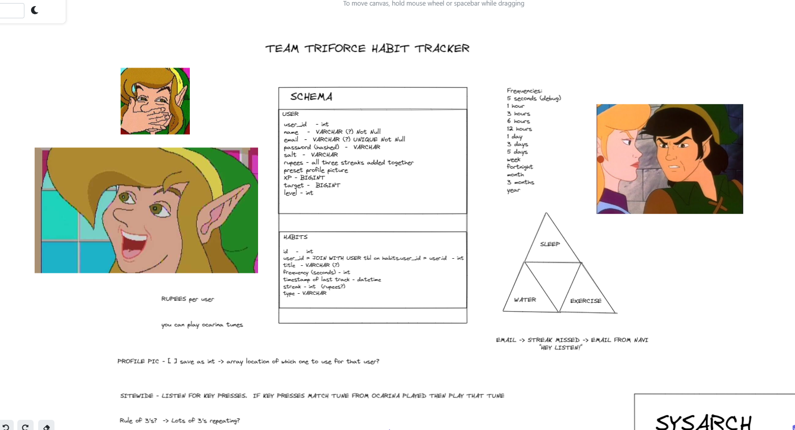
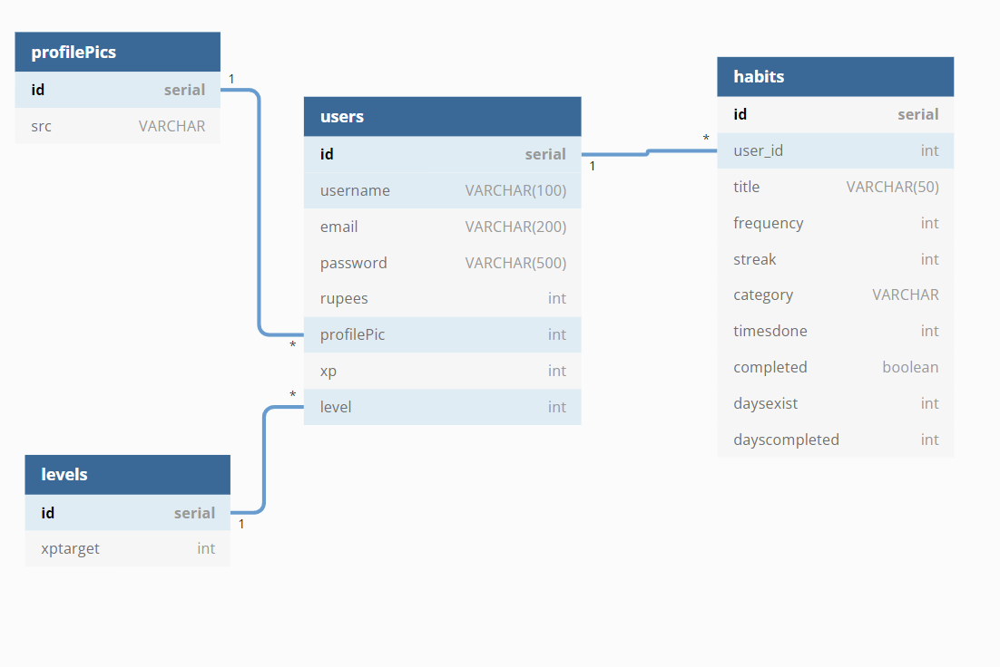
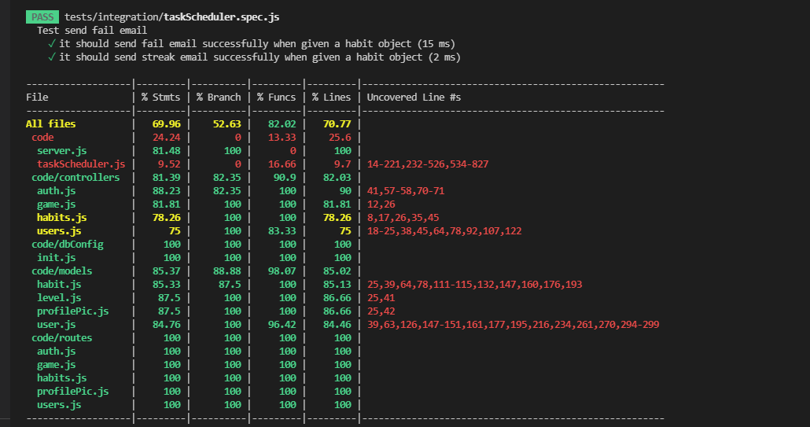

# Tryforce Habit Tracker
Fix your life with Link and Zelda

Gamified habit tracking application

## Installation and Usage

## Technologies
* postgreSQL
* Docker
* Express.js
* Node-Cron
* nodemailer

## Process
We began by brainstorming all the ideas for the application. We came up with this to begin with:

**(open image a new tab)**

## License
[CC BY-SA 4.0](https://creativecommons.org/licenses/by-sa/4.0/)

## Wins & Challenges
### Wins
### Challenges

# Design docs
## DB schema

# Api and server testing %s

# Email functionality

Users receive emails from Tingle or Navi if they miss a habit, or hit a streak of 10 for that habit

